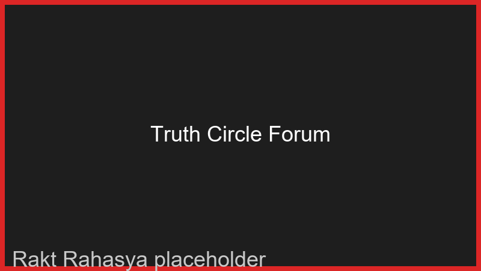
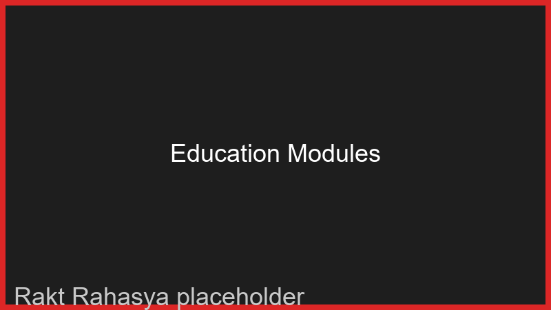

<div align="center">
  
  <h1>🌸 Rakt Rahasya</h1>
  <p><strong>A comprehensive menstrual health tracking and awareness application designed to empower women.</strong></p>
</div>

<br />

## 📸 Screenshots

*(Here are the screenshots of the beautiful UI of Rakt Rahasya)*

<div align="center">
  
  
  <br />
  
  
</div>

---

## ✨ Features

- **📱 User Dashboard**: Track your current cycle day, next period countdown, and quick logging for moods.
- **📅 Cycle Calendar**: A beautiful, interactive dark-mode calendar to view and edit daily logs.
- **📝 Daily Logging**: Track flow intensity, symptoms, notes, and self-care activities intuitively.
- **🤖 AI-Powered Insights**: Get personalized cycle predictions, fertility windows, and health recommendations.
- **👥 Truth Circle (Community)**: An anonymous, supportive community forum for questions, tips, and discussions.
- **📚 Education Center**: Interactive modules and resources covering menstrual hygiene, health, and stigma.
- **📍 Local Resources**: Find nearby clinics, helplines, and support centers.
- **🔔 Reminder System**: Stay on top of your cycle with timely notifications for periods, ovulation, and water intake.
- **🌓 Dark Theme Design**: Built with a stunning dark theme featuring deep reds, charcoal greys, and soft pink accents.

---

## 🛠️ Tech Stack

### Frontend
- **Framework**: [Next.js 14](https://nextjs.org/) (App Router)
- **Styling**: [Tailwind CSS](https://tailwindcss.com/)
- **Animations**: [Framer Motion](https://www.framer.com/motion/)
- **Icons**: [Lucide React](https://lucide.dev/)
- **Charts**: [Recharts](https://recharts.org/)

### Backend
- **Server**: [Node.js](https://nodejs.org/) & [Express.js](https://expressjs.com/)
- **Database**: [MongoDB](https://www.mongodb.com/) & Mongoose
- **Authentication**: JWT & bcryptjs

---

## 🚀 Getting Started

Follow these instructions to set up the project locally on your machine.

### Prerequisites

- **Node.js**: Version 18 or higher
- **MongoDB**: A running local MongoDB instance or a MongoDB Atlas cloud database string.

### Installation Process

1. **Clone the repository**
   ```bash
   git clone https://github.com/your-username/rakt-rahasya.git
   cd rakt-rahasya
   ```

2. **Install dependencies**
   ```bash
   npm install
   ```

3. **Set up Environment Variables**
   Create a `.env.local` file in the root directory by copying the example file:
   ```bash
   cp env.example .env.local
   ```
   
   Update `.env.local` with your MongoDB connection string and JWT secrets. 
   > **Note for Node.js 18+ Users**: If you are running MongoDB locally, make sure to use `127.0.0.1` instead of `localhost` to avoid IPv6 resolution errors:
   > `MONGODB_URI=mongodb://127.0.0.1:27017/rakt-rahasya`

4. **Start the Development Server**
   Run the following command to start both the Next.js frontend and Express backend concurrently:
   ```bash
   npm run dev:full
   ```

5. **Open the Application**
   - **Frontend**: Navigate to [http://localhost:3000](http://localhost:3000) in your browser.
   - **Backend API**: Running on [http://localhost:5000](http://localhost:5000).

---

## 📁 Project Structure

```text
rakt-rahasya/
├── app/                 # Next.js frontend pages & routing
├── components/          # Reusable React components (UI, Forms, Layouts)
├── server/              # Express backend API & database models
│   └── index.js         # Entry point for backend
├── types/               # TypeScript definitions
└── public/              # Static assets
```

---

## 🤝 Contributing

Contributions, issues, and feature requests are always welcome! 

1. Fork the Project
2. Create your Feature Branch (`git checkout -b feature/AmazingFeature`)
3. Commit your Changes (`git commit -m 'Add some AmazingFeature'`)
4. Push to the Branch (`git push origin feature/AmazingFeature`)
5. Open a Pull Request

---

## 📄 License

This project is licensed under the MIT License.

<div align="center">
  <p>Built with ❤️ to empower women's health</p>
</div>
